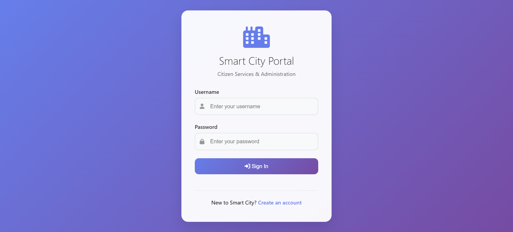
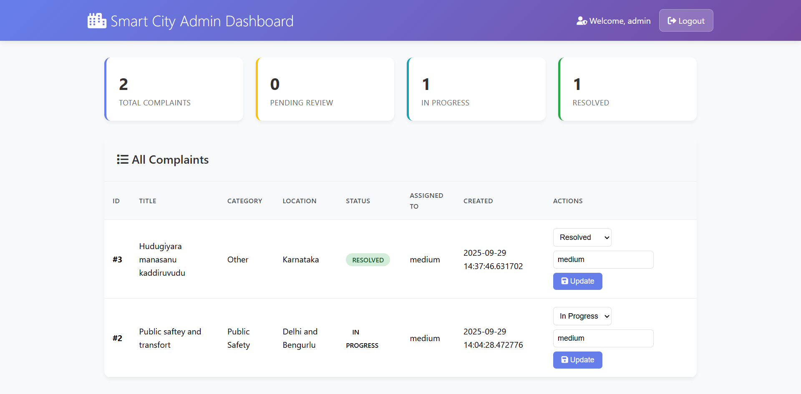
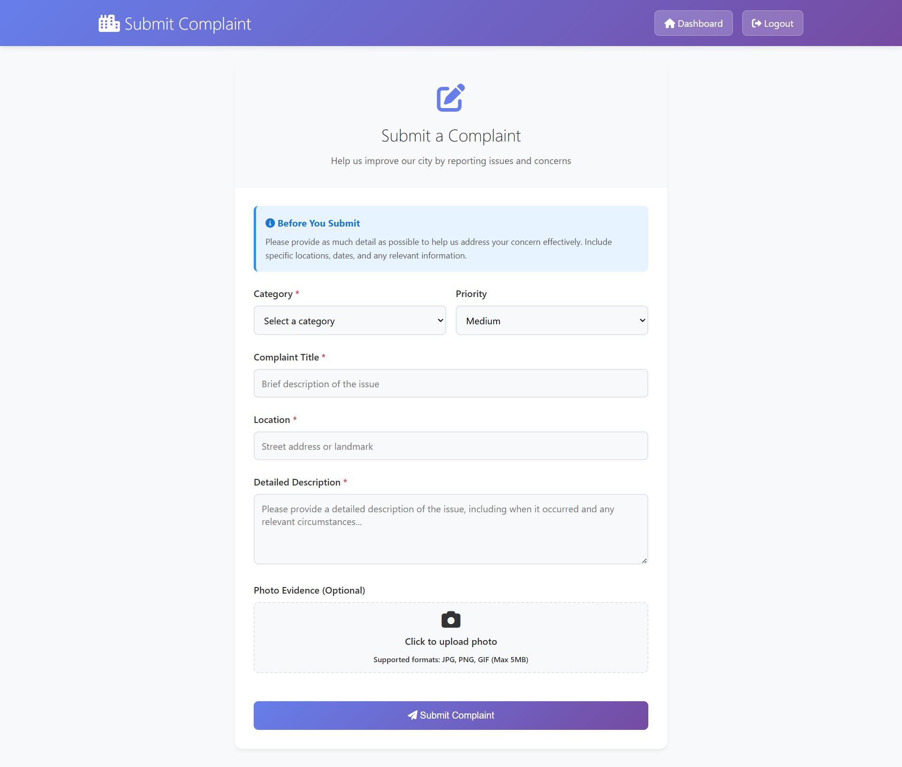

# 🏙️ Smart City Management System – Full Stack Java Web Application

> Enterprise-grade Java web application for streamlined urban infrastructure management and citizen services

[](https://www.oracle.com/java/)
[](https://www.mysql.com/)
[](https://tomcat.apache.org/)
[](https://www.docker.com/)
[](https://render.com/)

## 🌐 Live Demo

**🚀 Live Application**: https://smart-city-management-system-nnev.onrender.com

### 🔐 Demo Credentials
| Role | Username | Password | Description |
|------|----------|----------|-------------|
| 👨‍💼 **Admin** | `admin` | `admin123` | Full system access, manage complaints, user oversight |
| 👤 **Citizen** | `citizen1` | `test123` | Submit complaints, view personal dashboard |

## 📋 Project Overview

The **Smart City Management System** is a comprehensive Java web application designed to bridge the gap between citizens and municipal authorities. This role-based platform enables:

- **Citizens** to submit and track infrastructure complaints (roads, water, electricity, sanitation)
- **Administrators** to efficiently manage, assign, and resolve citizen complaints
- **Municipal authorities** to streamline urban infrastructure management and improve citizen services

Built with enterprise Java technologies, the system provides secure complaint management, real-time status tracking, and comprehensive administrative oversight.

## ✨ Key Highlights

• **Java EE Stack** - Built with enterprise-grade Servlets, JSP, JDBC, and Maven  
• **SHA-256 Security** - Industry-standard password hashing and secure session management  
• **Role-Based Dashboards** - Separate interfaces for citizens and administrators  
• **Complete Complaint Workflow** - From submission to resolution with status tracking  
• **MVC/DAO Architecture** - Clean separation of concerns with robust data access patterns

## 🛠️ Tech Stack

### Backend
- **Java 17+** - Core application logic and business rules
- **Java EE Servlets** - HTTP request handling and controller layer  
- **JDBC** - Database connectivity and data persistence
- **Maven 3.9+** - Build automation and dependency management

### Frontend  
- **JSP (JavaServer Pages)** - Server-side rendering and templating
- **HTML5/CSS3** - Modern web standards and responsive design
- **JavaScript (ES6+)** - Client-side interactivity and form validation
- **FontAwesome** - Professional iconography and UI components

### Database
- **MySQL 8.0+** - Primary relational database
- **PostgreSQL** - Alternative database support for flexibility

### Server & Infrastructure
- **Apache Tomcat 9.0+** - Java servlet container and application server

### Build Tool
- **Maven** - Project management, dependency resolution, and build automation

### Deployment & DevOps
- **Docker** - Containerization for consistent deployments
- **Render** - Cloud deployment platform with auto-scaling
- **Git** - Version control and collaborative development

## 🗄️ Database Design

### ASCII ER Diagram

```
    ┌─────────────────────┐           ┌─────────────────────┐
    │       USERS         │           │    COMPLAINTS       │
    ├─────────────────────┤           ├─────────────────────┤
    │ id (PK)            │           │ id (PK)            │
    │ username (UK)      │           │ user_id (FK)       │
    │ email (UK)         │◄──────────┤ category           │
    │ password_hash      │    1:N    │ title              │
    │ role               │           │ description        │
    │ created_at         │           │ location           │
    └─────────────────────┘           │ photo_url          │
                                      │ status             │
                                      │ assigned_to        │
                                      │ created_at         │
                                      │ updated_at         │
                                      └─────────────────────┘
```

### SQL Schema

#### Users Table
```sql
CREATE TABLE users (
    id INT AUTO_INCREMENT PRIMARY KEY,
    username VARCHAR(50) UNIQUE NOT NULL,
    email VARCHAR(100) UNIQUE NOT NULL,
    password_hash VARCHAR(64) NOT NULL,
    role ENUM('citizen', 'admin') DEFAULT 'citizen',
    created_at TIMESTAMP DEFAULT CURRENT_TIMESTAMP
);
```

#### Complaints Table
```sql
CREATE TABLE complaints (
    id INT AUTO_INCREMENT PRIMARY KEY,
    user_id INT NOT NULL,
    category VARCHAR(50) NOT NULL,
    title VARCHAR(200) NOT NULL,
    description TEXT NOT NULL,
    location VARCHAR(200) NOT NULL,
    photo_url VARCHAR(255),
    status ENUM('Submitted', 'In Progress', 'Resolved', 'Rejected') DEFAULT 'Submitted',
    assigned_to VARCHAR(100),
    created_at TIMESTAMP DEFAULT CURRENT_TIMESTAMP,
    updated_at TIMESTAMP DEFAULT CURRENT_TIMESTAMP ON UPDATE CURRENT_TIMESTAMP,
    FOREIGN KEY (user_id) REFERENCES users(id)
);
```

## 🚀 Quick Start Guide

### Prerequisites
- **Java 17+** - JDK installation required
- **Apache Tomcat 9.0+** - Servlet container
- **MySQL 8.0+** - Database server
- **Maven 3.9+** - Build tool
- **Git** - Version control

### Installation Steps

1. **Clone Repository**
```bash
git clone https://github.com/Sangu111/smart-city-management-system.git
cd smart-city-management-system
```

2. **Database Setup**
```bash
# Create database and import schema
mysql -u root -p < sql/smartcity.sql

# Verify database creation
mysql -u root -p -e "USE smartcity; SHOW TABLES;"
```

3. **Configuration**
Update database credentials in `src/main/resources/db.properties`:
```properties
db.url=jdbc:mysql://localhost:3306/smartcity?useSSL=false&serverTimezone=UTC
db.username=your_username
db.password=your_password
db.driver=com.mysql.cj.jdbc.Driver
```

4. **Build & Deploy**
```bash
# Clean and build application
mvn clean install

# Run with embedded Tomcat (recommended)
mvn tomcat7:run

# Alternative: Deploy WAR to Tomcat
# cp target/smart-city.war $TOMCAT_HOME/webapps/
```

5. **Access Application**
```
🌐 Local Development: http://localhost:8080/smart-city/
🚀 Live Demo: https://smart-city-management-system-nnev.onrender.com
```

## 🐳 Docker & Deployment

### Docker Setup

1. **Build Docker Image**
```bash
# Build application image
docker build -t smart-city-app .

# Verify image creation
docker images | grep smart-city
```

2. **Run with Docker**
```bash
# Run with environment variables
docker run -p 8080:8080 \
  -e JDBC_DATABASE_URL="jdbc:mysql://your-host:3306/smartcity" \
  -e JDBC_DATABASE_USER="your_username" \
  -e JDBC_DATABASE_PASSWORD="your_password" \
  smart-city-app
```

3. **Docker Compose (Recommended)**
```bash
# Start application with database
docker-compose up --build -d

# Check running containers
docker-compose ps

# View application logs
docker-compose logs -f app

# Stop all services
docker-compose down
```

### Environment Variables
| Variable | Description | Example |
|----------|-------------|---------|
| `JDBC_DATABASE_URL` | Database connection URL | `jdbc:mysql://localhost:3306/smartcity` |
| `JDBC_DATABASE_USER` | Database username | `smartcity_user` |
| `JDBC_DATABASE_PASSWORD` | Database password | `secure_password123` |

### Render Deployment
The application is deployed on **Render** with the following configuration:
- **Build Command**: `mvn clean package`
- **Start Command**: `java -jar target/smart-city.war`
- **Environment**: Java 17
- **Auto-Deploy**: Enabled from main branch

## 📸 Screenshots

### Login Interface

*Secure user authentication with role-based access*

### Admin Dashboard

*Complete complaint management and system oversight*

### Complaint Submission Form  

*Intuitive citizen interface for reporting infrastructure issues*

## 🎯 Skills Demonstrated

This project showcases comprehensive full-stack development expertise:

### 🖥️ **Java EE Development**
- Enterprise Java application architecture with Servlets and JSP
- JDBC for robust database connectivity and transaction management
- Maven for dependency management and build automation

### 🗄️ **Database Design & Management** 
- MySQL schema design with proper normalization (1NF, 2NF, 3NF)
- Complex SQL queries with JOIN operations and foreign key relationships
- Database performance optimization and indexing strategies

### 🌐 **Web Development**
- Responsive frontend design with HTML5, CSS3, and JavaScript
- Server-side rendering with JSP and dynamic content generation
- Cross-browser compatibility and mobile-responsive layouts

### 🔒 **Security Implementation**
- SHA-256 password hashing with salt for secure authentication
- Session management with role-based access control (RBAC)
- Input validation and SQL injection prevention using prepared statements

### 🏗️ **Software Architecture**
- Model-View-Controller (MVC) pattern implementation
- Data Access Object (DAO) pattern for clean data layer separation
- Layered architecture with proper separation of concerns

### 🚀 **DevOps & Deployment**
- Docker containerization for consistent deployment environments
- Cloud deployment on Render platform with environment configuration
- Version control with Git and collaborative development workflows

---

## 📄 License

[](https://opensource.org/licenses/MIT)

This project is licensed under the MIT License - see the [LICENSE](LICENSE) file for details.

---

<div align="center">

**🏙️ Smart City Management System**  
*Bridging Citizens and Municipal Authorities Through Technology*

[](https://github.com/Sangu111/smart-city-management-system)
[](https://smart-city-management-system-nnev.onrender.com)

</div>
